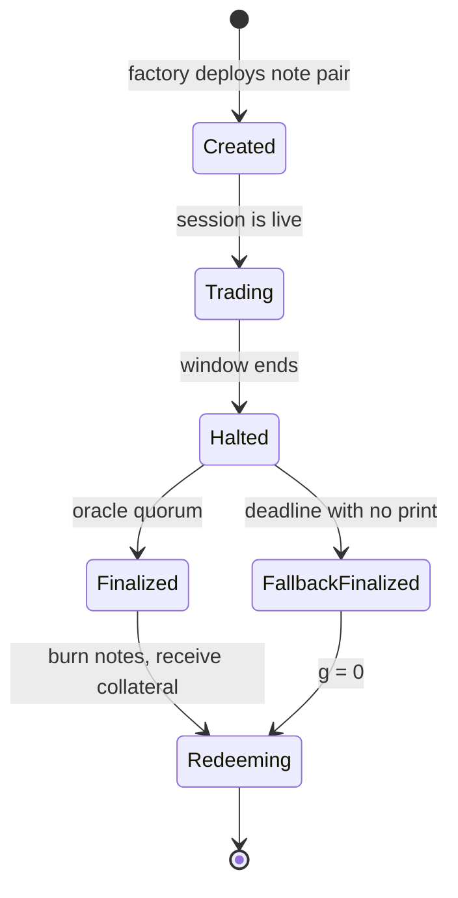
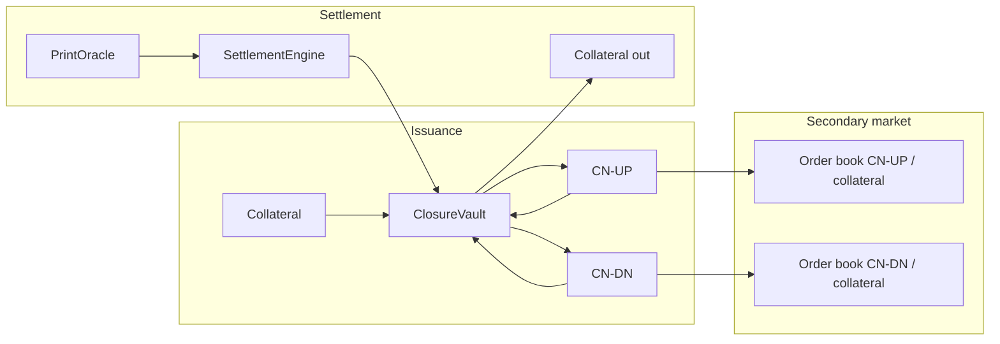
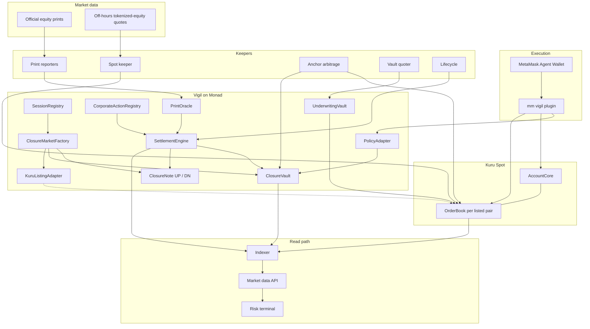
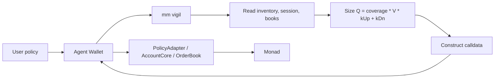
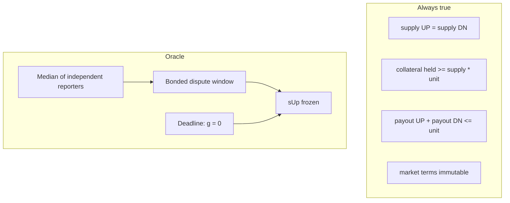

# Vigil

Vigil is a clearing protocol for scheduled market-closure risk. It turns the return between an official close and the next official open into a fully collateralized, capped, bearer instrument that can be minted, traded, and redeemed onchain.

The unit of trading is a calendar interval, not an asset.

## Why this market exists

Tokenized equities trade continuously. The shares behind them do not. US equity markets are closed for most of the week. A market maker quoting a tokenized name during those hours has no hedge in the underlying — not an expensive hedge, no hedge. Every quote is a naked inventory position held until the opening auction.

That risk is currently priced into spreads. Off-hours spreads on tokenized equities run several times regular-hours spreads, and widen further around weekends and macro events. The loss stays inside the market-making system because there is no instrument that transfers it.

Existing workarounds do not close the gap:

- Widening and withdrawing is rational, and is the source of the tax.
- Proxy hedges (index futures, correlated crypto, a perpetual against tokenized spot) leave basis, idiosyncratic, and margin risk. Earnings gaps are the exposure that matters, and no index hedges them.
- Charging the taker more during closures redistributes the loss. It does not create a counterparty who wants the risk.

Vigil is that missing market. Someone who must shed closure risk sells it. Someone who wants priced jump exposure over a scheduled discontinuity buys it.

## The instrument

A **Closure Note** is a fully collateralized, capped-linear claim on the return realized across a scheduled market discontinuity.

A market is the tuple `(ticker, session, kUp, kDn, collateral)`. Anyone may deposit collateral and receive one CN-UP and one CN-DN per unit deposited. There is no issuer and therefore no issuer credit risk.

Let \(P_{\text{close}}\) be the official closing print at the start of the window, \(P_{\text{open}}\) the official opening-auction print at the end, and \(\text{adj}\) the corporate-action factor (default 1).

```
r   = P_open / (P_close * adj) - 1
g   = clamp(r, -kDn, +kUp)
sUp = (g + kDn) / (kUp + kDn)
sDn = 1 - sUp
```

CN-UP redeems for `sUp` units of collateral. CN-DN redeems for `sDn`. The pair sums to exactly one unit under every price path, including oracle failure.

- One unit is a claim on the clamped close-to-open return of a named reference, at a named cap.
- `kUp` and `kDn` may differ. Symmetric markets set them equal. A ladder of symmetric and one-sided caps implies a market distribution of closure-jump risk per name.
- Corporate actions adjust `P_close` through `adj`. A print that never arrives settles at `g = 0`: the no-move split.
- Caps bind in extreme moves. The worst case is known in closed form at mint time.

This is not an option (no strike, premium, or exercise), not a perpetual (finite life, no funding, no liquidation), and not a binary prediction market. Resolution is a regulated exchange auction print, not a committee.

## Market lifecycle



| State | Mint | Pair burn | Transfer | Redeem |
| --- | --- | --- | --- | --- |
| Trading | yes | yes | yes | no |
| Halted | no | yes | no | no |
| Finalized / fallback | no | yes | yes | yes |

Trading stops before the print is published. The halt is enforced in the note: transfers revert while the market is halted, so an external order book cannot match through the gate. Pair burn stays open because it is price-independent.



Minting charges a small fee on top of the deposit so the vault always holds exactly one unit of collateral per outstanding pair. Pair burn returns that unit at any time, with no fee. That path is what pins `price(UP) + price(DN) = 1` across the two books.

## Who uses it

**Sellers of closure risk** hold tokenized-equity inventory through a close. They buy CN-DN (or mint a pair and sell CN-UP) so that a gap against them is offset by the note. First users are the desks that already quote those names and pull size when the underlying session ends.

**Buyers of closure risk** want the other side of that gap: event exposure without a brokerage account, a premium for bearing inventory risk that cannot currently be laid off, or a cleaner expression than crossing a wide off-hours spot spread.

**Lenders** that accept tokenized equities as collateral have tail risk concentrated in the gap. The cap ladder is a traded input to haircuts, not a fixed guess.

The first quote on a new market is the underwriting vault: protocol-seeded capital that sells protection inside per-name and aggregate budgets. That is a real participant, not a simulated book.

## Architecture

Vigil separates issuance from listing. The protocol creates the notes and settles them. Secondary trading is on Kuru Spot, once a market is verified against the venue registry.



### Contracts

| Contract | Role |
| --- | --- |
| `SessionRegistry` | Exchange calendars and closure windows, including holiday and halt rules. |
| `CorporateActionRegistry` | Per-session adjustment factor. Writable only before the window starts. |
| `PrintOracle` | Multi-reporter submissions, deviation-bounded median, bonded dispute, deadline fallback. |
| `PythPrintReporter` | Permissionless path: pulls a Pyth update, checks publish time against the legal print band, submits as a reporter. |
| `ClosureMarketFactory` | Deploys a note pair per market. Terms are immutable once the market exists. |
| `ClosureVault` | Custody, pair mint, pair burn, redeem. Owns the solvency invariants. |
| `ClosureNote` | ERC-20 leg. Mint and burn restricted to the vault. Transfers gated while halted. |
| `SettlementEngine` | Halt, finalize, fallback. Freezes `sUp`. |
| `KuruListingAdapter` | Records a listing request and binds a Kuru OrderBook only after venue verification. It does not deploy books. |
| `UnderwritingVault` | ERC-4626 that mints pairs and quotes the protection leg inside risk limits. |
| `PolicyAdapter` | Allowlisted entrypoint for agent execution: market list, per-window notionals, account caps. |

Live market terms cannot be changed by governance. Governance may add future tiers and fees. It cannot rewrite a market that already exists.

### Settlement data

Official close and open prints are stored per `(ticker, session)`, not per cap. Every market on that name settles against the same event.

Pyth equity feeds publish on the exchange calendar and go quiet when the session is closed. They are used for prints, not as a continuous during-window price. The during-window anchor is the off-hours tokenized-equity market, mirrored onchain so the note books can be arbitraged against a live venue.

On networks where the tokenized equity itself is not listed, a spot-proxy token is used as that onchain venue. Its price is driven by real off-hours quotes. It is a stand-in for the listing, not a stand-in for the mechanism.

### Secondary trading

Notes are intended to trade as ordinary spot pairs (CN-UP / collateral, CN-DN / collateral) on Kuru. Listing is a venue operation: the token must be enabled in AccountCore and the OrderBook must appear in the router registry. Vigil binds that address after those checks pass.

Orders go through AccountCore custody and the native `batch` interface (limit, post-only, IOC, FOK, and exact-input swap). Passive liquidity bands are the cold-start depth on a newly listed book.

## Agent execution

Closure risk exists when desks are not staffed. Unattended execution under explicit policy is part of the product, not an accessory.

`mm vigil` is a MetaMask Agent Wallet plugin. It reads inventory and live books, sizes a hedge from the same payoff the chain settles, and submits every transaction through the wallet. The plugin never holds keys, session tokens, or a bypass around signing, policy, or MFA.



Typical mandates:

```
mm vigil cover --book tokenized-equities --window next --max-cost 20bps --cap auto
mm vigil quote NVDA --window 2026-10-16 --cap 10% --side sell --size 250000
mm vigil underwrite --basket sp100 --exclude earnings --budget 500000 --max-per-name 25000
mm vigil roll --if-pinned --widen-to 25%
mm vigil settle --all --redeem --report
```

A desk can authorize a TRADE-only Kuru signer with an expiry and no withdraw bit, so a watch loop can quote without the ability to empty the account.

## Economics

| Item | Rule |
| --- | --- |
| Mint fee | Charged on top of collateral (protocol default: a few basis points). Accrues to the fee sink, never to vault backing. |
| Pair burn | Free. Must stay cheap; it is the pair-consistency arb. |
| Redeem | Free. Friction here would weaken settlement. |
| Venue fees | Kuru maker / taker schedule on listed books. |
| Underwriting | Earns the closure premium across a diversified book, minus gaps that hit. Per-name caps bound a single weekend. |
| Collateral | 100% upfront. Not rehypothecated. Yield-bearing collateral is a later revision. |

The protocol does not take market risk. Holders of the notes do. Insolvency of the vault from payoff is structurally excluded: the pair cannot redeem for more than the collateral held.

## Risk and invariants



I1 and I2 hold while a market is live: mint and pair-burn change both supplies together. After finalization, one-sided redeem is allowed and I4 is the solvency check (`collateralHeld >= payoutUp(supplyUp) + payoutDn(supplyDn)`).

- Settlement references the official opening auction, not a DEX TWAP. An attacker has to move that print, not a thin onchain pool.
- A stalled oracle is a symmetric refund, not a solvency event.
- A manipulated during-window anchor does not change settlement. Arbitrageurs take the dislocation.
- Trading is already halted when the print is posted, so oracle front-running is not a category.
- Flash-loaned minting cannot change a price-dependent settlement state. Mint is 1:1.
- The remaining loss vector is the collateral asset de-pegging. That is disclosed, not papered over.

A Closure Note is a cash-settled derivative that references a security. Vigil does not custody, issue, or transfer the security. Participation gating is the path to a restricted venue. That surface is real and is treated as such.

## Repository

```
contracts/     Protocol, oracle, vaults, listing adapter
packages/      Shared SDK, market data, risk math
services/      Keepers, indexer, API
plugin/        MetaMask Agent Wallet plugin
apps/          Risk terminal
research/      Gap history, surface, market evidence
```

The TypeScript payoff used by agents and keepers is tested against the Solidity library on a shared vector file. Hedge sizing and onchain redemption must agree.

## Status

Issuance and settlement contracts are implemented. Production prints come from `PrintOracle`: a reporter quorum, a deviation bound, and a bonded dispute that can only void a print. `PythPrintReporter` pulls an Equity.US Pyth update and submits it when the publish time sits in the session's print band. `SessionRegistry` holds both compressed `VIGIL_SYNTH` windows and the NYSE cash calendar; Nasdaq cash equities use those same dates. Corporate-action adjustments and delist flags are timelocked and cannot be applied after their deadline. `InjectedPrintOracle` is a test helper and is not on the deploy path. Testnet collateral is `TestCollateral` (VUSD), a 6-decimal stand-in, not a native stablecoin listing.

`KuruListingAdapter` records a listing and binds an order book after SpotRouter and AccountCore both verify it and the book parameters match the requested spec, including passive spread through `computeAddress`. Trading stays closed until that bind. SDK order encoders call `@toxicflow-labs/ts-sdk`, so a plugin and a keeper share one calldata path. The slot manager places only into a free slot of the 62 and cancels with the current order id. The Kuru listing request is drafted and unsent. No Closure Note book is registered. Order-path checks run against the live MON/USDC book.

Shared prices and risk math live in `@vigil/marketdata` and `@vigil/riskmodel`. Every quote carries a source. The off-hours anchor is the cross-check of CoinGecko and Jupiter xStock prices. Official session bars come from Yahoo's chart, or from Polygon when `POLYGON_IO_API_KEY` is set. Hermes equity metadata is public; Hermes price updates still return 401 and the adapter refuses to invent a print. Fair value is the anchor passed through the same split as `ClosureMath`. The hedge size `(kUp + kDn) · V · coverage` is tested against that payoff. No Closure Note book is listed, so the fair-value command prints a model band and says so.

Nothing in this document should be read as a live deployment, a listed market, or a promise of return. Published testnet numbers will point at a transaction, an oracle submission, or a named data source.

## License

Source license will be declared with the first contract commit.
